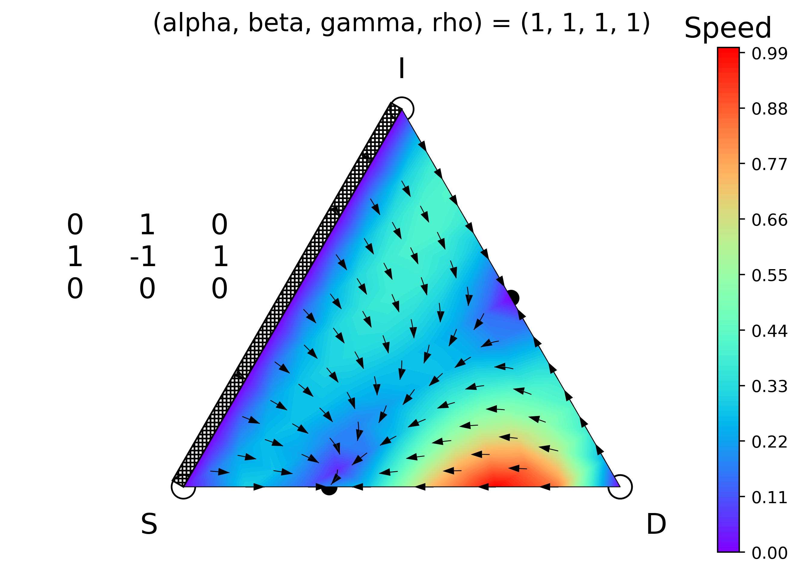

# egtplot: A python package for 3-Strategy Evolutionary Games

As a very general model of cooperation and competition, EGT is well-suited to quantitative investigations of the dynamics of interactions between populations. EGT has been used to model phenomena from disparate areas of study, from [poker](http://www.mdpi.com/2073-4336/7/4/39) to [hawks and doves](https://www.nature.com/articles/246015a0) to [cancer](https://www.nature.com/articles/bjc2011517). In many biological EGT models, payoffs are taken to represent the resources a particular organism can extract from its environment given its interaction in that environment with another organism utilizing the same or perhaps a different strategy.


 

First introduced by [Taylor and Jonker](https://www.sciencedirect.com/science/article/pii/0025556478900779) in 1978, the replicator equations is one of the most important game dynamics in EGT.
In its the most general mathematical form, the replicator equations are given by


where x<sub>i</sub> and f(x<sub>i</sub>) is the ratio and fitness of type of i in the population. For the sake of simplicity it is often assumed that fitness is linearly proportional to the population distribution. In this case the replicator equations can be written as


where the matrix A is a payoff matrix with element A<sub>ij</sub> representing fitness of type i over type j.

In this software package, we assume the above form of the replicator equations on a 3-dimensional simplex, meaning we model only three-strategy evolutionary games.


### Dependencies

This software package depends on the following libraries:

* `numpy>=1.13, scipy, shapely` for computations
* `matplotlib` for static plots
* `imageio, moviepy` for animations
* `tqdm` for progress bar

### Installation
* You can clone this repository using `git` software
```
git clone
```
* The software is also available on `pypi`
```
pip install
```
* Alternatively you can copy `egtplot.py` file locally and start using as a module.
```
import egtplot
```

### Usage
* This software has two main functions: `plot_static` for plottting static simplex figures and `plot_animated` for generating simplex animations.
* For detailed usage of these functions we refer to our interactive jupyter notebook: [`demonstration.ipynb`](demonstration.ipynb)
