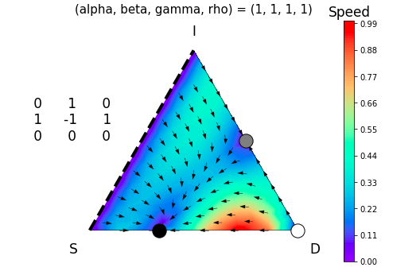
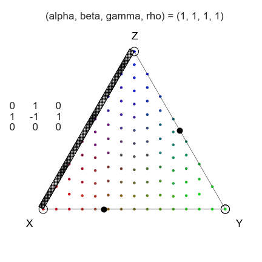

# egtplot: A Python Package for Three-Strategy Evolutionary Games

[](http://joss.theoj.org/papers/10.21105/joss.00735)
[](https://pepy.tech/project/egtplot)

This is a software package for plotting and animating three-strategy evolutionary games on a triangular simplex.
* The package can be used to create phase portraits of 3-strategy games



* It can also be used to animate transient behavior of the game  



### Use Cases

While there are many use cases for this software, our group's particular focus is on the mathematical modeling of cancer and cancer therapies through evolutionary game theory [@kaznatcheev2017cancer, @kaznatcheev2015edge, @Kaznatcheev179259]. For details on analytical treatments of evolutionary games, please see Artem Kaznatcheev's blog at [Theory, Evolution, and Games Group](https://egtheory.wordpress.com/).

### Authorship

Inom Mirzaev and [Drew FK Williamson](https://github.com/drew-williamson) contributed equally to this work.

### Dependencies

The program is written and tested on Python >=3.5. This software package depends on the following libraries:

* `numpy>=1.13, scipy, shapely` for computations
* `matplotlib` for static plots
* `imageio, moviepy` for animations
* `tqdm` for progress bar

Installing the package from `PyPi` will take care of all the dependencies
```
pip install egtplot
```
### Installation

* Easiest way to install the package is through `PyPi`
```
pip install egtplot
```

* You can clone this repository using `git` software and run setup.
```
git clone https://github.com/mirzaevinom/egtplot.git
cd egtplot
python setup.py install
```

* Alternatively you can download and extract a zip file of this repo:
```
cd egtplot-master
python setup.py install
```

* Finally, we also have created a Docker container for running a jupyter notebook with egtplot:
[drewfkw/egtplot](https://hub.docker.com/r/drewfkw/egtplot/)

### Specific Usage
* This software has two main functions: `plot_static` for plotting static simplex figures and `plot_animated` for generating simplex animations.
* For detailed usage of these functions we refer to our interactive jupyter notebook: [`egtplot_demonstration.ipynb`](egtplot_demonstration.ipynb)
* We also welcome comments and questions regarding our whitepaper on [bioRxiv](https://www.biorxiv.org/content/early/2018/04/12/300004) which describes the package and its usage. The content is nearly identical to the jupyter notebook linked above.

### Citation
If you use this program to do research that leads to publication, we ask that you acknowledge use of this program by citing the following in your publication:

```
Mirzaev I., Williamson D. and Scott J., egtplot: A Python Package for 3-Strategy Evolutionary Games, https://doi.org/10.1101/300004
```

### Acknowledgements

* The authors would like to thank [Mathematical Biosciences Institue](http://mbi.osu.edu) (MBI) at Ohio State University, for partially supporting this research. MBI receives its funding through the National Science Foundation grant DMS 1440386.
* We gratefully acknowledge the work of Hanna Schenk whose code on her [github](https://github.com/HannaSchenk/RQchaos) inspired this project.

### Contributing and Issues
Please use [GitHub Issues](https://github.com/mirzaevinom/egtplot/issues) for issue tracking and bugs. Feel free to contact [Drew](https://github.com/drew-williamson) and [Inom](https://github.com/mirzaevinom) if you would like to contribute to `egtplot` or with questions and comments.
